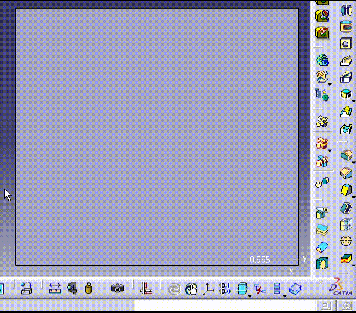

# UCLC(Use CAITA Like AutoCAD)
# 像 AutoCAD 一样使用 CATIA  
---
## 简介

**UCLC** 是采用 [AutoHotkey](https://www.autohotkey.com/) 编写的一个命令管理脚本，旨在将 CATIA 的命令操作习惯替换成 AutoCAD 那样：`组合字符命令` + `空格`执行，提高画图效率

### 没有 UCLC 的快捷键实现方式

#### P1

众所周知，CATIA 在启用 P1 用户界面后，可以自定义单键来执行命令，比如自定义C画圆，L画直线…… 但是，在众多的模块中，类似的操作，命令却不相同（草图和GSD里画圆就不是同一个命令），26个字母根本不够用[掀桌]

#### P2

当切换到P2用户界面后，窗口右下角多了一个 命令输入框 --> “ 超级输入”，配置 工具 - 选项- 常规 - 搜索 - 超级输入的默认前缀 - "c: 作为 命令" ，这样我们就能通过输入`组合字符` + `回车` 来执行命令。大部分命令可以通过 工具 - 自定义- 命令 - 显示属性 来设置快捷键或者是用户别名。

但是，有相当数量的命令是跨工作台的，并且有着相同的名称，使用相同的用户别名调用会出现执行混乱。比如零件设计与GSD的布尔添加命令就是这样，都是“添加...”，所以，为了区分这两个命令，我可能会把PBA（Part Boolean Add）给零件设计工作台，GBA给GSD工作台。问题解决了，但我要多记住更多的命令。
### UCLC 的快捷键实现方式
现在，有了UCLC（Use CAITA Like AutoCAD），你可以在零件设计工作台用`BA`+`空格`来执行零件的布尔添加，在创成式外形设计工作台也用`BA`+`空格`来执行包络体的布尔添加，而不用额外记住我要用哪个工作台的布尔添加。同样，你可以用`L`来定义你在所有的工作台里画直线，不管是草图还是GSD，或者是工程图工作台……

你可能注意到了，有了UCLC，执行命令已经像AutoCAD一样是用空格键了！是的，这确实也是让CATIA操作起来更像AutoCAD的一点。

#### 启用UCLC后，使用命令在草图中绘制圆以及约束直径



## 主要功能
1. 自定义用户别名
1. 自定义快捷键（Ctrl/Shift/Alt/F1~12）
1. 用户别名、快捷键自适应。同一类功能，同一个命令
1. 空格键 执行上次的命令

## 功能特性

经过不断的演进，UCLC 已从单纯的按键映射，成长为一个兼具 CATIA 专业辅助与通用效率提升的伴生工具。

### 针对 CATIA 专属特性
1. **自定义用户别名**：基于 “类似 AutoCAD 的空格确认” 发送命令，无缝对接 CATIA P2 界面超级输入框。
2. **命令缓存及 Hdr 自动修正**：记录已知命令的状态并能从误判的报警窗口中自我修复后缀。
3. **工作台、实例环境防呆兼容**：在多进程和未知工作台之间也能保证安全不乱码。
4. **自定义组合热键响应**：打破传统 26 个字母的桎梏，利用组合修饰键安全响应。
5. **产品结构树自动排序**：针对特定繁琐对话框提供一键自动排序辅助。
6. **快速操作零部件以指定方向 移动/平移**：响应速度远快于鼠标通过罗盘操作。
7. **`Shift + Tab` 窗口切换**：在多个独立的 CATIA 打开的子窗口中进行针对性循环遍历。

### 普遍适用的功能
1. **Everything 全局快速唤出**：双击 `右Ctrl` 键，随时唤醒文件检索。（若未配置将唤出 **交互式 GUI** 指导路径配置）
2. **虚拟桌面平滑流转**：按住 `Win+鼠标滚轮` 动态切换虚拟桌面（Windows 11 友好体验）。
3. **音量多媒体统一管理**：按住 `右Alt` 并滚动鼠标滚轮调节全局音量，点击鼠标中键（亦或 `^ + F5/F10`）实现静默。
4. **自动切换英文输入法**：通过系统钩群防呆切换输入法为纯英，避免输入法卡顿乱码。

## 使用方法

### 1. 安装 AHK
脚本支持 [Autohotkey V2](https://www.autohotkey.com/)。 [下载地址](https://www.autohotkey.com/download/ahk-v2.exe)

### 2. CATIA 启用 POWER-INPUT 输入框
CATIA 配置：

- 工具 - 选项 - 常规 - 常规 - 用户界面样式（P2）
- 工具 - 选项 - 常规 - 搜索 - 超级输入的默认前缀 （下拉列表 - 无）

### 3. 配置用户自定义文件


### 4. 启动脚本

下载 [UCLC最新版本](https://github.com/zedeeee/UCLC/releases/latest)，解压后运行UCLC.ahk


## 别名和热键自定义
***从`v2.2.1`开始，用户配置文件示例迁移到 [UCLC-config](https://github.com/zedeeee/UCLC-config)，欢迎分享自定义方案***

自定义方法查看[UCLC-config](https://github.com/zedeeee/UCLC-config)  
用户自定义设置位于`./user-conifg/`目录下，文件结构如下

```
user-config/
    |-- CAT_Alias.ini			（实例文件，包含几个简单的用户别名）
    |-- CAT_Hotkey.ini			（实例文件，包含几个简单的快捷键）
```

## 兼容性
- 系统：windows10及以后的版本

- CATIA: V5R2017/V5R21

- 语言：简体中文

## 联系方式
有任何兼容性问题、疑问和建议欢迎在 issues 提交

## 致谢

- [mudssky](https://github.com/mudssky/myAHKScripts) （autoIME）
- 【&杰√ （结构树自动排序）
