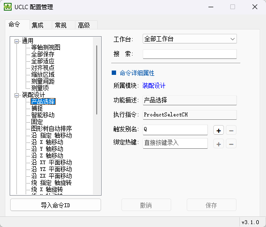
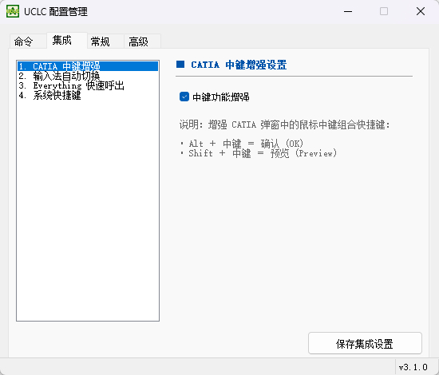

# UCLC (Use CATIA Like AutoCAD)
# 像 AutoCAD 一样使用 CATIA  
---

## 简介

**UCLC** 是采用 [AutoHotkey v2](https://www.autohotkey.com/) 编写的 CATIA 效率增强工具。旨在将 CATIA 的命令操作习惯替换为类似 AutoCAD 的 `组合字符命令` + `空格` 执行方式，大幅提升绘图与建模效率。

从 **v3.0.0** 开始，UCLC 迎来了全新的进化，全面推行**图形化配置中心**、**CATIA 中键快捷操作** 以及 **内置在线更新服务**，让软件的配置与使用体验更加直观方便。

---

## 💡 核心功能特性

### 🎨 全新图形化设置中心 (Settings Center)
无需手动修改复杂代码，只需在托盘菜单点击“设置”或使用快捷键，即可唤出全新的图形界面：

1. **别名与快捷键可视化管理**：图形化添加、修改或删除命令别名与快捷键，自适应同一类功能在不同工作台的映射。
2. **工作台预设命令库导入与对比**：
   - 内置预设工作台命令库，可快速选择导入。
   - 支持从 CATIA 导出的 Workshop Exposition `.txt` 文件，自动对比差异（新增、更新、删除等）并一键应用更新。
3. **工作台内部 ID 智能自适应**：全面改用 CATIA 内部工作台 ID 匹配，彻底解决不同语言版本（如中文、英文版）CATIA 工作台识别与命令绑定错乱问题。
4. **AutoIME 输入法规则配置**：灵活设置在 CATIA 或其他应用中的输入法自动切换规则，避免中文输入法卡顿乱码。
5. **Everything 极速搜索集成**：一键唤醒文件检索，支持图形化选择与配置 Everything 执行路径。
6. **常规与系统辅助选项**：支持一键开启 **开机自动启动**、**创建桌面快捷方式**，以及配置快捷按键（全局音量调节、快速唤出计算器等）。

---

### 🖱️ CATIA 中键快捷操作（v3.0.0 全新新增）

针对 CATIA 绘图与建模场景，重新设计了鼠标中键快捷响应机制：

- **弹窗快速确认与预览**：在 CATIA 弹出命令窗口（如倒角/圆角、垫块、旋转体等）时，通过 **Alt + 中键** 快速触发“确定”，**Shift + 中键** 快速触发“预览”，无需频繁移动鼠标点击对话框按钮。
- **开关自如**：可在图形化设置中心随心开启或关闭中键快捷操作功能。

---

### 🛠️ 实用工具与系统性能优化

- **内置 WindowSpy 侦测工具**：托盘工具菜单内置 WindowSpy 便捷入口，方便快速侦测窗口属性与控件信息。
- **CATIA 操作稳定性提升**：底层事件机制与状态捕获全面升级，进一步提高了常用快捷操作的响应速度与交互稳定性。

---

## 🛠️ 使用与配置说明

### 1. 环境准备
- **操作系统**：Windows 11
- **解释器**：[AutoHotkey v2](https://www.autohotkey.com/download/)

### 2. CATIA 基础配置 (POWER-INPUT 输入框)
为了配合 UCLC 的超级输入响应，请在 CATIA 中进行如下配置：
- `工具` -> `选项` -> `常规` -> `常规` -> `用户界面样式` 设置为 **P2**
- `工具` -> `选项` -> `常规` -> `搜索` -> `超级输入的默认前缀` 下拉列表选择 **无**

### 3. 配置自定义方式
- **图形化设置（推荐）**：启动 UCLC 后，右键任务栏托盘图标选择 `设置...` 即可完成全部配置。
- **旧版配置迁移与兼容**：首次启动前，将旧版 `config.ini` 及 `./user-config/` 目录下的 `.ini` 文本配置文件直接复制到 3.0 版本对应目录下即可自动无缝迁移。3.0 版本仍保持对旧版配置文件的兼容支持，但**计划于 2027 年正式废弃**，建议优先使用图形化设置中心进行配置管理。

---

## 💻 兼容性与测试环境

- **测试验证环境**：CATIA V5-6R2017 (Windows 10 / Windows 11)
- **兼容性**：理论兼容 CATIA V5 其他常见版本（如 V5R21，V5-6R2018 等）。

---

## 💬 联系与反馈

如在使用过程中遇到任何问题或有改进建议，欢迎提交 [GitHub Issues](https://github.com/zedeeee/UCLC/issues)。

---

## 🙏 致谢

- [mudssky](https://github.com/mudssky/myAHKScripts)（AutoIME 参考）
- 【&杰√（结构树自动排序逻辑）
