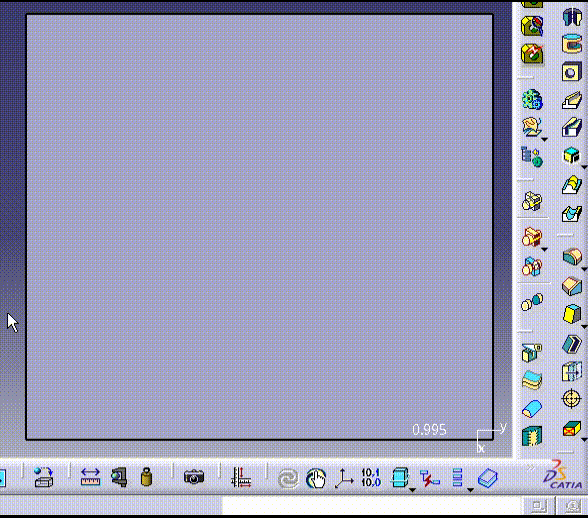

# UCLC(Use CAITA Like AutoCAD)
# 像 AutoCAD 一样使用 CATIA  
---
## 前言

**UCLC** 是采用 [AutoHotkey](https://www.autohotkey.com/) 编写的一个按键辅助脚本，旨在将 CATIA 的命令使用操作习惯替换成 AutoCAD 那样：`组合字符` + `空格`是输入命令，空格是执行上一次命令……

### 没有 UCLC 的快捷键实现方式

#### P1

众所周知，CATIA 在启用 P1 用户界面后，可以配置单快捷键来执行命令，比如说C画圆，L画直线…… 但是，在众多的模块中，类似的操作，命令却不同（在草图和GSD里画圆就不是同一个命令），26个字母根本不够用[掀桌]

#### P2

当切换到P2用户界面后，窗口右下角多了一个 命令输入框 --> “ 超级输入”，再设置 工具 - 选项- 常规 - 搜索 - 超级输入的默认前缀 - "c: 作为 命令" ，这样我们就能通过输入`组合字符` + `回车` 来执行命令。大部分命令可以通过 工具 - 自定义- 命令 - 显示属性 来设置快捷键或者是用户别名。

但是，有相当数量的命令是跨工作台的，比如零件设计与GSD的布尔命令就是这样的，我可能会把PBA（Part Boolean Add）给零件设计工作台，GBA给GSD工作台。问题是解决了，但我要多记住更多的命令。
### UCLC
现在，有了UCLC（Use CAITA Like AutoCAD），你可以在零件设计工作台用`BA`+`空格`来执行零件的布尔添加，在创成式外形设计工作台也用`BA`+`空格`来执行包络体的布尔添加，而不用额外记住我要用哪个工作台的布尔添加。同样，你可以用`L`来定义你在所有的工作台里画直线，不管是草图还是GSD，或者是工程图工作台……

你可能注意到了，有了UCLC，执行命令已经像AutoCAD一样是用空格键了！是的，这确实也是让CATIA操作起来更像AutoCAD的一点。



## 主要功能
1. 自定义快捷键（Ctrl/Shift/Alt/F1~12）
1. 自定义用户别名
1. 用户别名自适应。一个别名，不同工作台，不同命令
1. 在 CATIA 自动切换输入法为英文
1. 空格键 执行上次的命令
1. `Shift + Tab`在多个 CATIA 窗口循环切换

## 附加功能
1. 双击 `右Ctrl` 键呼出 Everything（软件本身需要设置快捷键`win+]`）

## 使用方法

### 1. 安装 AHK
脚本支持 [Autohotkey V2](https://www.autohotkey.com/)。 [下载地址](https://www.autohotkey.com/download/ahk-v2.exe)

### 2. CATIA 设置 P2版本
CATIA 配置： 工具 - 选项 - 常规 - 用户界面样式（P2）

### 3. 双击 UCLC.ahk 启动脚本

下载[UCLC](https://github.com/zedeeee/UCLC/releases/latest)，解压后运行UCLC.ahk


## 用户自定义
**从`v2.2.1`开始，用户配置文件示例转移到 [UCLC-config](https://github.com/zedeeee/UCLC-config.git)**

用户自定义设置位于`./user-conifg/`目录下

```
user-config/
    |-- CATAlias.ini
    |-- CATAlias_en.ini
```


### config.ini

`config.ini`主要用于配置脚本初始化设置

```ini
[通用]
DEBUG=0
扫描间隔=1000

[SubConf]
用户别名=CATAlias.ini
```
**[通用]**			配置Debug状态和工作台扫描间隔（ms）  

**[SubConf]**	定义辅助配置文件，目前只关联了一项`用户别名`

> *可以新建一个`CATAlias_en.ini`并修改`用户别名=CATAlias_en.ini`*
> *这样就可以在英文环境使用了*

### CATAlias.ini

`CATAlias.ini`用于自定义用户别名和快捷键映射

```ini
[工作台]
2001=零件设计
2002=装配设计
2003=草图编辑器
3006=创成式外形设计
2009=工程制图
2019=Generative Sheetmetal Design

[通用]
; 注释
M=测量间距 ; 注释

[装配设计]
S=捕捉

[零件设计]
S=草图
BA=添加...

[草图编辑器]
REC=矩形

[创成式外形设计]
3C=3D 曲线

[工程制图]
CC=圆
L=直线

[Generative Sheetmetal Design]
S=草图

[HotKey]
; ^ -> Ctrl
; + -> Shift
; ! -> Alt
F2=属性
!q=交换可视空间
^+!s=保存管理
```
**[工作台]**	定义哪些工作台启用专有用户别名

**[通用]** 	存放各工作台通用的命令

**[装配设计] [零件设计] [草图编辑器]**……	每个 Section 下是对应工作台的专有用户别名（实时生效）

**[HotKey]** 	存放快捷键映射（需要脚本重启 ）

所有的用户别名，建议以软件命令名配置以提高兼容性